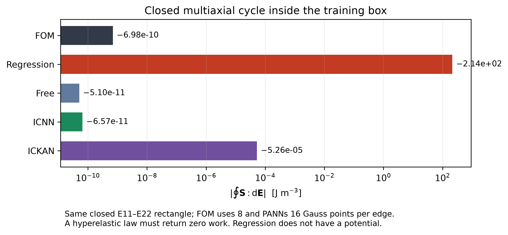
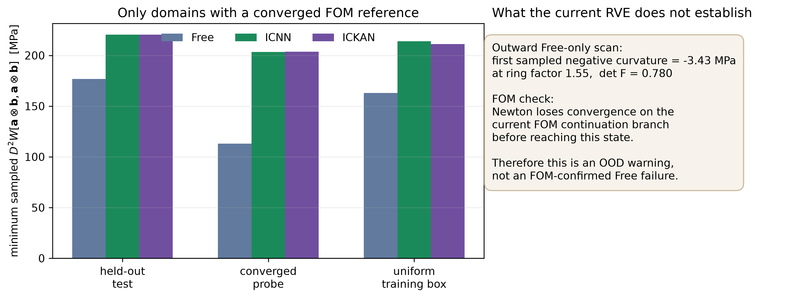

# Current-RVE mechanical witnesses

This is the strictly scoped mechanics audit for the existing periodic,
rotated-elliptical-void RVE.  It uses frozen checkpoints only: no architecture,
training datum, hyperparameter, or selected model was changed.

The point is not to manufacture a failure.  It asks two different questions
whose answers are useful even if every macro FE2 calculation converges:

1. Does direct stress regression violate hyperelastic path independence?
2. Does the current RVE provide an FOM-confirmed state that distinguishes a
   free energy from a polyconvex one?

The executable source is `mechanics_witnesses.py`; all numeric artifacts are
in `mechanics_witness_results/` and include checkpoint SHA256 hashes.

## Witness A — closed multiaxial cycle

At the held-out, in-box centre

```text
E = [ 0.00512600, -0.09455076, -0.12837206 ],
```

we traverse a counter-clockwise rectangle of half-width `1e-3` in the two
independent components `(E11,E22)`, keeping `gamma12` fixed.  The path begins
and ends at the same strain.  A hyperelastic response therefore obeys

```text
integral S : dE = 0.
```

| model | closed-cycle work [J/m3] |
|---|---:|
| periodic FOM | `-6.98e-10` |
| Regression | `-2.139e2` |
| Free | `-5.10e-11` |
| ICNN | `-6.57e-11` |
| ICKAN | `-5.26e-05` |

The FOM used eight Gauss points per edge; the PANN values shown use 64.  The
file records convergence from 8 through 128 points: Regression remains
`-2.139e2` while the ICKAN residual decays from `-2.16e-2` to `4.62e-6`, which
identifies it as quadrature error through its spline knots, not a physical
loop work.

This is an FOM-controlled, in-domain falsification of **Regression as a
hyperelastic material law**.  It does not claim that Regression must fail in
every FE2 boundary-value problem.



## Witness B — rank-one stability audit

For each state and sampled unit direction `b`, the audit evaluates the
finite-strain Legendre--Hadamard expression

```text
D2 W(F)[a⊗b,a⊗b]
 = a.T [ B.T (dS/dE) B + (b.T S b) I ] a,
```

including the geometric stress term.  The minimum is taken over the sampled
`a` and 180 directions `b`; inspecting eigenvalues of `dS/dE` alone would not
be the relevant finite-strain test.

| domain with FOM reference | Free [MPa] | ICNN [MPa] | ICKAN [MPa] |
|---|---:|---:|---:|
| 400 held-out test states | 176.68 | 220.49 | 220.47 |
| 345 converged probe states | 113.03 | 203.28 | 203.54 |
| 12,000 uniform in-box states | 149.90 | 214.55 | 210.89 |

No sampled negative direction occurs in those domains for any of the three
energy tiers.  Thus, for this RVE and its verified FOM branch, we cannot claim
an observed mechanical failure of Free.

An independent outward scan of Free finds its first sampled negative direction
at ring factor `1.55`, with `det(F)=0.780` and curvature `-3.43 MPa`; its
energy finite differences reproduce the sign.  However, the periodic FOM
Newton continuation loses convergence before reaching that state.  It is an
OOD warning, not a reference-confirmed Free instability.  The result is
preserved in `current_rve_free_radial_scan.json` and
`current_rve_first_negative_fom_verification.json`.



## Consequence for the paper

The existing RVE has a precise role:

- It gives a clean, inexpensive and mathematically direct reason to use an
  energy model instead of direct stress Regression.
- It provides the main coupon FE2 accuracy/cost benchmark already completed.
- It **does not** honestly separate Free from ICNN/ICKAN through an
  FOM-confirmed instability.  The second RVE should be designed to supply a
  different, independently motivated material/loading regime; a Free failure
  is a falsifiable outcome to audit there, not a promised result.

## Reproduction

```bash
PYTHONPATH=coupon_fe2_paper/.pydeps:/home/sares/Kratos_Eigen_Check/bin/Release \
python3 -B coupon_fe2_paper/06_pann/mechanics_witnesses.py --cycle-only --with-fom-cycle

PYTHONPATH=coupon_fe2_paper/.pydeps:/home/sares/aero-f/.venv_torch_cpu/lib/python3.12/site-packages \
python3 -B coupon_fe2_paper/06_pann/mechanics_witnesses.py --free-radial-only

PYTHONPATH=coupon_fe2_paper/.pydeps:/home/sares/Kratos_Eigen_Check/bin/Release \
python3 -B coupon_fe2_paper/06_pann/mechanics_witnesses.py \
  --fom-candidate-from coupon_fe2_paper/06_pann/mechanics_witness_results/current_rve_free_radial_scan.json
```
