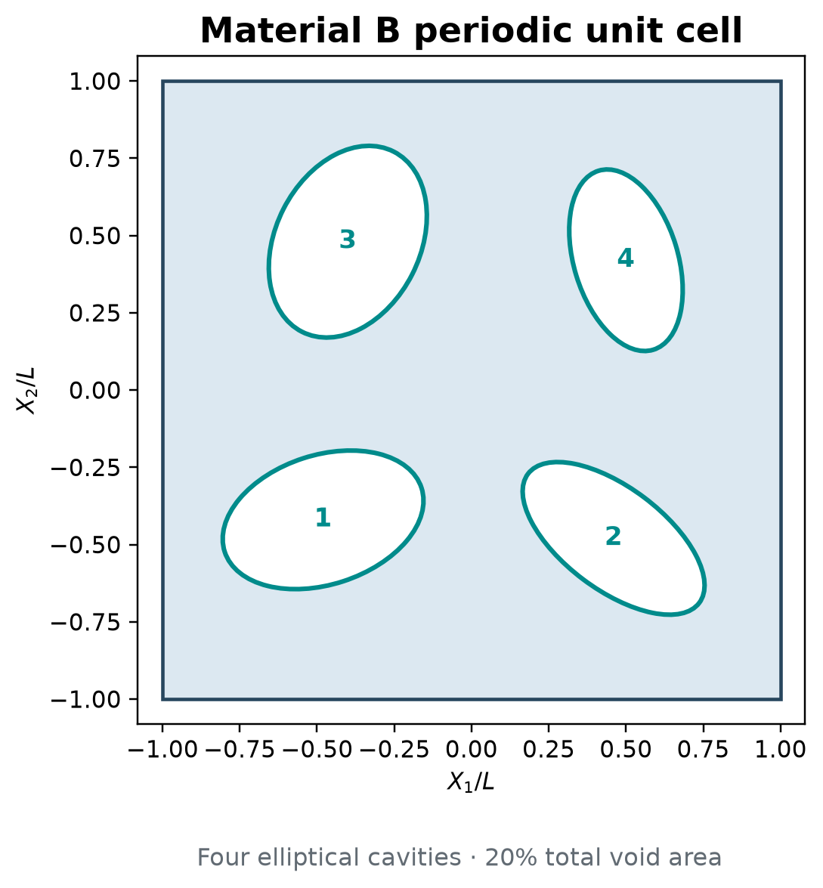
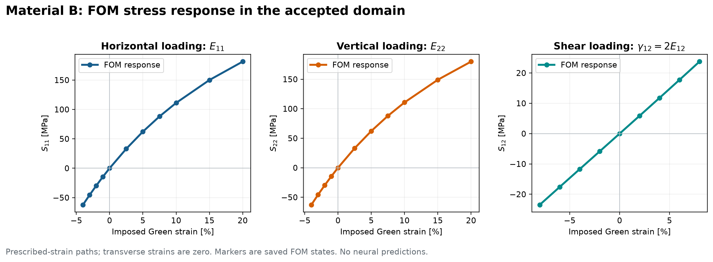

# Material B — start here

Material B is a periodic two-dimensional porous material used to test whether
the proposed paired-feature energies generalize beyond Material A. Its unit
cell contains four different elliptical cavities with total porosity 20%.

## Current status

| Question | Answer |
|---|---|
| Is the RVE geometry fixed? | **Yes.** Four elliptical cavities; 20% porosity. |
| Is the strain domain fixed? | **Yes.** `E11,E22 in [-0.04,0.20]`, `2E12 in [-0.08,0.08]`. |
| Are the FOM labels complete? | **Yes.** All declared states were solved and the numerical acceptance checks passed. |
| Is the shared feature table fixed? | **Yes.** One 32-feature table is shared by ICNN/ICKAN fixed and learned variants. |
| Are neural models trained? | **The single official 15-run campaign is running.** Its live status is `results/neural_training/campaign_status.json`; prior neural pilots are archived as reports only. |
| Has test or path accuracy been inspected? | **No.** Those predictions remain reserved until all 15 checkpoints are locked. |

The physical strain coordinate is

    e = (E11, E22, gamma12),   gamma12 = 2 E12,

and its work-conjugate stress is `(S11,S22,S12)`. Therefore the shear bound
`gamma12 = +/-0.08` means `E12 = +/-0.04`.

## What to read

Read only these three items first:

1. [Paper evidence](paper_evidence/README.md): separate figures for the
   geometry, mesh, 3D statistical design and FOM stress response.
2. [FOM campaign report](reports/CAMPAIGN_REPORT.md): why the labels were
   accepted and what those checks do **not** prove.
3. [Training preparation](reports/TRAINING_PREPARATION.md): the five model
   types, three seeds and shared fixed/learned initialization.

Everything else supports reproduction or records development decisions.

## Data in one table

| Role | States | Used for |
|---|---:|---|
| Fit | 4,200 | Feature selection, normalization and parameter optimization |
| Validation | 512 | Selecting a checkpoint within each run |
| Test | 512 | Final interpolation accuracy after all checkpoints are locked |
| Held-out paths | 10 x 40 nonzero states | Final response curves after checkpoint lock |
| Reference | 1 | Zero energy/stress and reference-tangent anchor |

Additional repeated solves check mesh sensitivity and cold-start agreement;
they are numerical audits, not extra training samples.

## Folder map

| Location | Audience | Meaning |
|---|---|---|
| `paper_evidence/` | Everyone | The only reader-facing figures and their short explanations |
| `reports/` | Authors/reviewers | Scientific decisions, limitations and unfavorable outcomes |
| `protocol/` | Developers | Frozen data/training rules and current preparation code |
| `results/data_labels_v1.*` | Training code | Approved assembled labels and their acceptance record |
| `results/feature_selection_v1/` | Training code | Shared 32-feature table and initialization checks |
| `results/neural_training/` | Training code | The only official 15-run campaign; `needs_review` is not a completed fit |
| `results/data_campaign_v1/` | Auditors only | 310 raw campaign records; do not browse this to understand the study |
| `tests/` | Developers | Small implementation and integrity tests |
| `archive/` | Historians only | Failed, superseded or navigation records retained deliberately |
| Other root scripts/folders | Reproduction only | Frozen FOM stages whose paths appear in provenance records |

The remaining root-stage folders are chronological evidence, not alternative
current datasets:

1. `pilot_v2/` and `refinement_v1/`: initial geometry and mesh study;
2. `preflight_*`: reference-mesh and solver checks;
3. `nonlinear_*`: larger-strain exploration;
4. `expanded_*`: rejected attempt with larger shear — retained because it failed;
5. `asymmetric_*`: accepted domain with larger normal tension only;
6. `results/data_campaign_v1/`: final campaign chunks.

Their recorded paths and hashes are why they have not been renamed merely for
appearance. Nine completed diagnostic/plotting scripts were removed from
the active root and placed byte-identically in `archive/legacy_code/`. Another
103 redundant per-chunk copies of `run_data_stage.py` were deleted after their
bytes were verified against the single frozen source; reports already record
that source's hash. The copies can be regenerated exactly and carried no labels.

## FOM response before training

The markers and lines are accepted FOM values along three prescribed-strain
paths. There is no linear reference and no trained-model result in this figure.

## Exact next step

Monitor the [official 15-run campaign](results/neural_training/campaign_status.json)
and inspect any `needs_review` or failed run before taking a next step. The
[single training recipe](protocol/training_recipe.json) and
[official runner](protocol/train_material_b_official.py) govern every run.
The [pilot summary](reports/TRAINING_PILOT_SUMMARY.md) explains why previous
budgets were not accepted. Do not open final test/path predictions until all
15 official fits satisfy their validation stop rules and checkpoints are
hash-verified.

The old 286-line root README is preserved as
[`archive/DEVELOPMENT_README.md`](archive/DEVELOPMENT_README.md); it is a
development record, not required reading.
