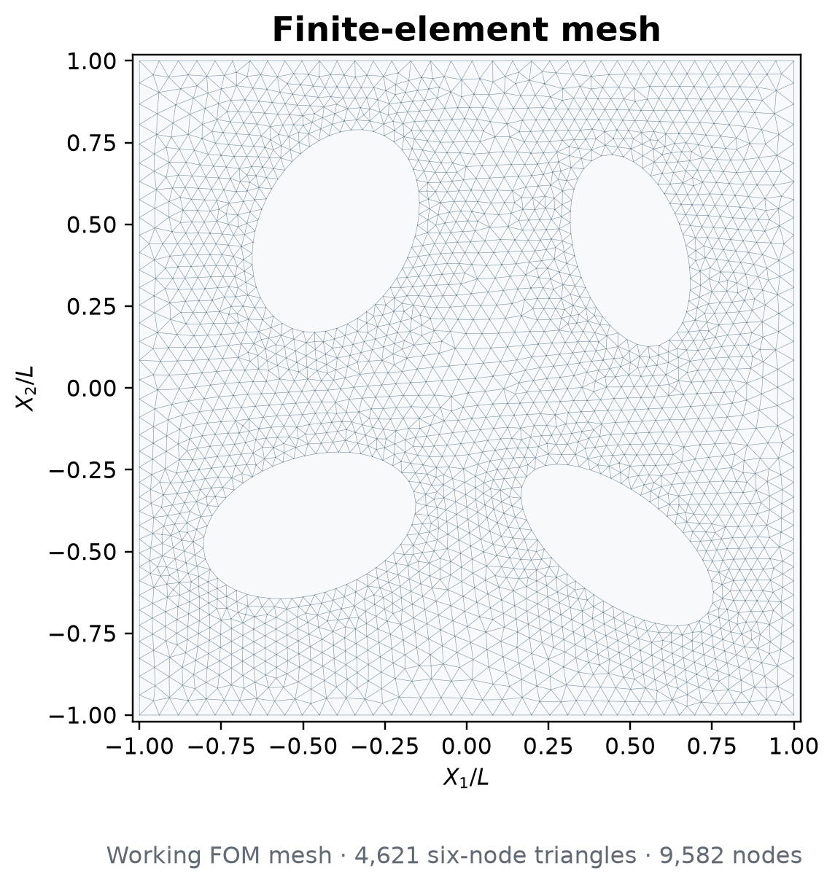
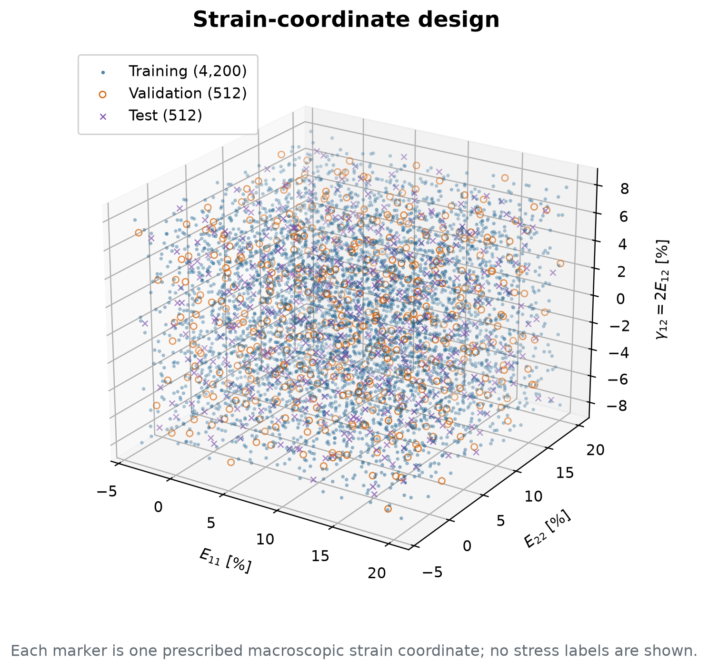

# Material B — reader-facing evidence

Four figures answer four separate questions. Nothing here reports neural-model
accuracy: training has begun, but final test/path evaluation remains closed.

## 1. What is the RVE?

A square periodic cell contains four elliptical cavities with total porosity
20%. The numbers only identify the cavities; they are not material phases.

## 2. What mesh produced the FOM data?

The working discretization has 4,621 six-node triangles and 9,582 nodes. For
readability, the figure draws element boundaries between corner nodes; the
midside nodes of the quadratic elements are not marked individually.

## 3. Where are the statistical samples?

Every marker is one prescribed macroscopic Green-strain coordinate
`(E11,E22,2E12)`. Blue points are used for fitting, orange points for validation
and purple points for the final test. These are coordinates in strain space,
not locations inside the RVE.

Displaying the test **coordinates** does not inspect the reserved test
**responses**. This figure loads no test stress, tangent, or energy labels.

## 4. What does the FOM response look like?

The curves contain saved FOM stresses along three simple prescribed-strain
paths. The horizontal coordinate is imposed Green strain, not time, and the
transverse strain components are zero. Therefore these are not
uniaxial-stress tests. No linear reference and no neural prediction are shown.

## Provenance

Run `build_figures.py` to regenerate all PNG and PDF files.
`source_manifest.json` records the exact source hashes and confirms that only
test coordinates—not reserved test/path labels—were loaded.

Detailed solver diagnostics belong in `../reports/` or `../results/`, not in
this reader-facing folder.
